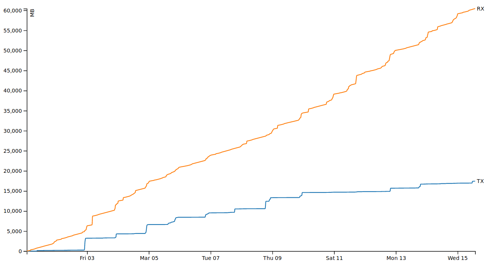

# Traffic Monitoring for MikroTik Routers
Monitors and stores the total amount of traffic on a MikroTik router interface using a web-server with sqlite, php and d3.js

## Server-Setup
HTTP(S) server setup to receive and store traffic values

Required: HTTP(S) server (e.g. nginx with php7.0-fpm) and sqlite3

### Database
A sqlite database needs to be created to store traffic values, e.g. in file /var/mikrotik-traffic.sqlite.
- A schema needs to be created to store timestamp, transceived (tx) and received (rx) bytes as well as dtx and drx (differences to the previous values):
  - ```sqlite3 /var/mikrotik-traffic.sqlite "create table traffic(timestamp int, tx int, rx int, dtx int, drx int)"```
- This file will be written by the http(s) server and belongs to its user or group, e.g. www-data:
  - ```chown www-data.www-data /var/mikrotik-traffic.sqlite```

### HTML and PHP
HTML an PHP files need to be available from the web. The directory var/www/mikrotik-traffic-status contains:

traffic-receiver.php
- to handle http(s) requests from the MikroTik router and to write traffic values to file /var/mikrotik-traffic.sqlite
- This script will also store the IP of the MikroTik router in /var/mikrotik-ip.txt (for applications like dynamic DNS)

traffic-aggregator.php 
- to read mikrotik-traffic.sqlite and 
- aggregate (in the given example) monthly traffic figures for transceived (tx) and received (rx) bytes

traffic-monitor.html 
- calls traffic-aggregator.php 
- shows a graph rendered in JavaScript using d3.js (file d3.v4.min.js - see https://d3js.org/)



Note that it does make sense to obfuscate the names of the php scripts when using HTTPS.


## MikroTik Script
A MikroTik router can be configured to send traffic values with a script.

In System -> Scripts a script needs to be placed to read traffic values from an interface (port) like ether1. 
- create a new script with name "send-traffic" with "read" and "test" policy enabled
- insert the contents of mikrotik-traffic-send-script.txt
- change the ether1 to the interface where traffic is to be measured and the url to the location of your php script

In System -> Scheduler a schedule needs to be created to execute the script
- Interval (e.g. every 10 minutes): 00:10:00
- On Event: send-traffic
- Policies "read" and "test"

Note that traffic count is restarted on reboot, so that a maximum of 10 minutes (as set in "Interval") of traffic can get lost.

Tested with MikroTik hAP ac running RouterOS 6.37.
